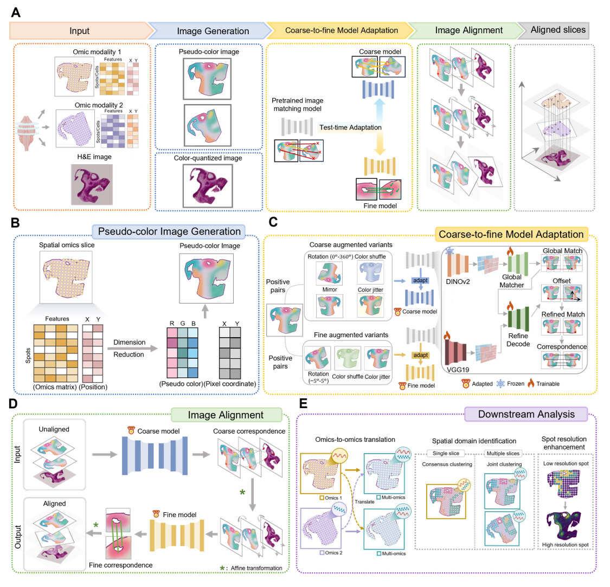

# SpaMOMA

**Unifying and aligning spatial multi-omics slices via image-based feature matching**

  

SpaMOMA is a computational framework for **unpaired spatial multi-omics slice alignment**.  

SpaMOMA designs a **coarse-to-fine alignment strategy** based on *test-time adaptation*, tailoring an image feature matching model to spatial pattern images (SPIs). This enables automated and high-precision alignment **without manual landmarks or matched molecular features across different omics modalities**.

Beyond alignment, SpaMOMA facilitates downstream analyses including:

- 📍 Coordinate-based omics-to-omics translation  
- 🧬 Multi-omics spatial domain identification  
- 🔬 Histology-guided spot resolution enhancement  

This scalable and robust framework lowers technical barriers for unpaired spatial multi-omics integration and paves the way for comprehensive multimodal tissue analysis.

## 📚 Tutorials

Step-by-step tutorials are available:

- In the `Tutorials/` folder of this repository  
- Via our ReadTheDocs documentation:  
  👉 *[]*

## 📦 Datasets

### Public Datasets

**Mouse Hippocampus Dataset**  
https://singlecell.broadinstitute.org/single_cell/study/SCP1375/

**Mouse Olfactory Bulb Dataset**  
- Stereo-seq: https://github.com/JinmiaoChenLab/SEDR_analyses/tree/master/data  
- 10X Visium: https://www.10xgenomics.com/datasets/adult-mouse-olfactory-bulb-1-standard-1  

**Spatial CUT&Tag–RNA-seq Mouse Coronal Brain Dataset**  
https://web.atlasxomics.com/visualization/Fan  

**Stereo-CITE-seq Mouse Thymus Dataset**  
https://db.cngb.org/  

**Transcriptomics–Metabolomics Mouse Brain Dataset**  
https://data.mendeley.com/datasets/w7nw4km7xd/1  

**MISAR-seq Mouse Embryonic Brain Dataset**  
https://github.com/gpenglab/MISAR-seq  

**Xenium Human Breast Cancer Dataset**  
https://www.10xgenomics.com/products/xenium-in-situ/human-breast-dataset-explorer  

### Processed Data

Processed datasets used in our experiments are available at:

👉 https://pan.baidu.com/s/17K1cmxOPmhSvV6dG6gnafw?pwd=sjbx

## ✉️ Contact

If you have any questions or need support, please feel free to contact us:

📩 **Jianxing Zhang**  
24126421@bjtu.edu.cn